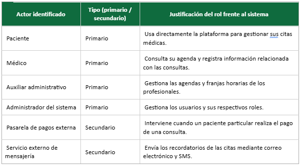
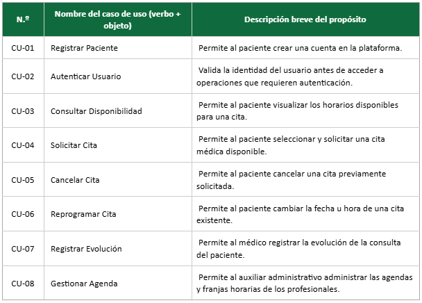
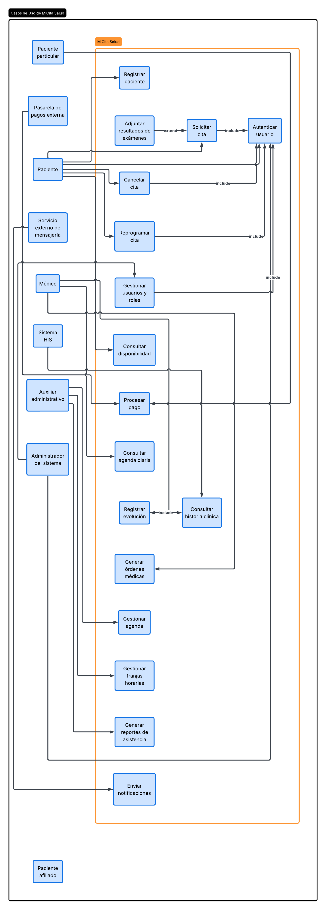
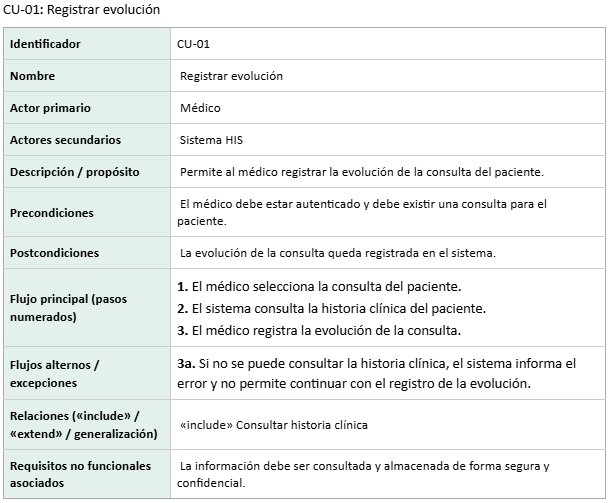
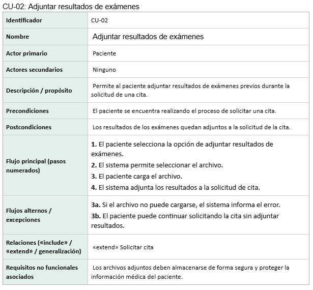

Fase 1
- **Conforme el equipo, seleccione una herramienta de modelado y justifique en dos párrafos su
elección comparándola con al menos otra alternativa (criterios sugeridos: licenciamiento,
soporte de UML 2.5, exportación, colaboración en la nube, curva de aprendizaje).**

    La herramienta seleccionada fue lucidchart, esta herramienta es bastante cómoda y sencilla de usar, y más con la ayuda de su IA, tiene una interfaz agradable y diversas herramientas que permiten realizar cualquier diagrama. Además de esto, también ofrece la posibilidad de trabajar en equipo desde la nube y exportar los diagramas en varios formatos diferentes.

Fase 2
- **A partir del caso de estudio, diligencie las siguientes tablas. Recuerde que los actores primarios persiguen un objetivo sobre el sistema, mientras que los secundarios prestan un servicio de soporte al sistema o al actor primario.**

Fase 3
- **Elabore el diagrama de casos de uso del sistema «MiCita Salud» respetando la notación estándar de UML.**

Fase 4
- **Documente dos (2) casos de uso empleando la siguiente plantilla: uno de ellos debe ser obligatoriamente el que contiene la relación «extend» y el otro uno que contenga una relación «include».**

Fase 5
- **Responda de forma argumentada, en máximo una página:**

    - **¿A cuál de las tres categorías de modelos (estructural, de comportamiento o funcional) pertenece el diagrama que construyó? Justifique con base en lo que el diagrama representa y en lo que deliberadamente omite.**

        El diagrama de casos de uso pertenece principalmente a un modelo funcional, porque representa qué funciones ofrece el sistema y qué actores interactúan con ellas. Deliberadamente omite detalles sobre la estructura interna del sistema, como clases o bases de datos, y también el orden detallado en que ocurren las actividades.

    - **Mencione dos limitaciones concretas de los diagramas de casos de uso evidenciadas en este caso de estudio e indique qué otro diagrama UML complementaría cada limitación y por qué.**

        - No muestra el flujo detallado ni la secuencia de acciones de cada proceso. Esto puede complementarse con un diagrama de actividades, ya que permite representar paso a paso el flujo, decisiones y caminos alternativos. 
        - No muestra la estructura interna ni las relaciones entre los datos y objetos del sistema. Esto puede complementarse con un diagrama de clases, que permite representar las clases, atributos y relaciones necesarias para implementar el sistema.

    - **Explique cómo el uso de un sistema de control de versiones distribuido aporta trazabilidad al proceso de modelado cuando varios analistas trabajan sobre el mismo modelo.**

        Un sistema de control de versiones distribuido permite registrar quién realizó cada cambio, cuándo lo hizo y qué modificación realizó sobre el modelo. Además, facilita que varios analistas trabajen simultáneamente mediante ramas y fusiones, conservando el historial de cambios y permitiendo recuperar versiones anteriores. Esto aporta trazabilidad y control al proceso de modelado.